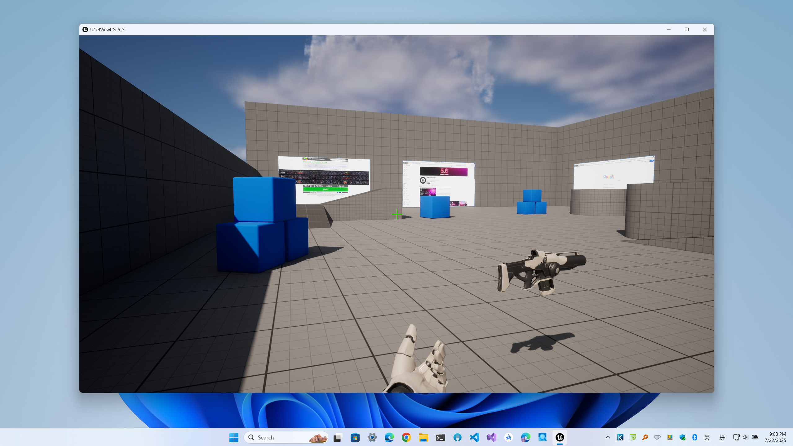
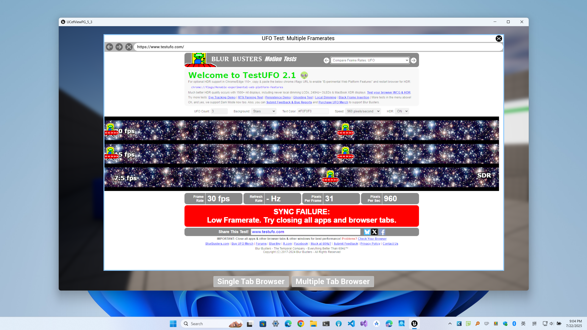

# UCefView

## Fab
[UCefView Marketplace](https://fab.com/s/ec232806c889)

## Demo

- **Source**: [UCefViewPlayGroud](https://github.com/CefView/UCefViewPlayGroud)
- **Packages**:
  - **Win64**: [UCefViewPlayground-UE5.3-Win64](https://drive.google.com/file/d/1SfPZ7mCKH93ngUeyo3rbqbYjf7AHl11a/view?usp=sharing)
  - **macOS**: [UCefViewPlayground-UE5.3-macOS](https://drive.google.com/file/d/1yXzLW_jgtA8IwEBPIFRCKX7Y2sOhVJx_/view?usp=sharing)
  - **Linux**: [UCefViewPlayground-UE5.3-Linux](https://drive.google.com/file/d/1zRFStxa_zhpJXF9o6uXAA57BwUEh9eZ8/view?usp=sharing)

## Documents
[UCefView Documents](https://cefview.github.io/UCefView)

## Screenshots

| Platform | In-Game | Menu |
|:---:|:---:|:---:|
| **Windows** |  |  |
| **macOS** |  |  |
