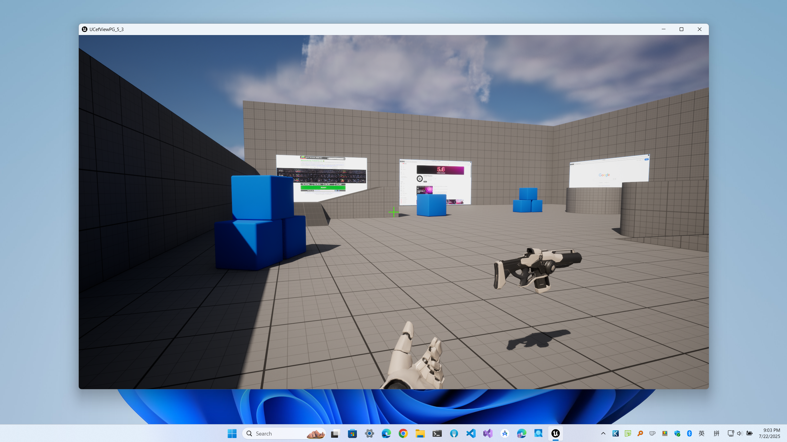
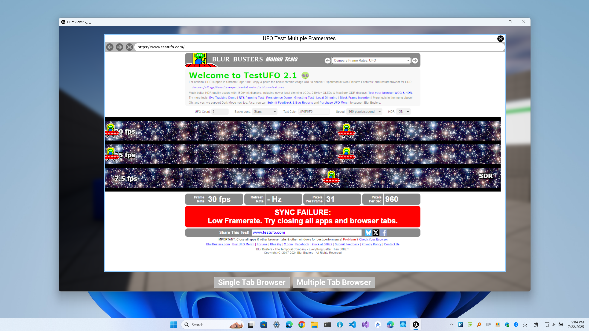
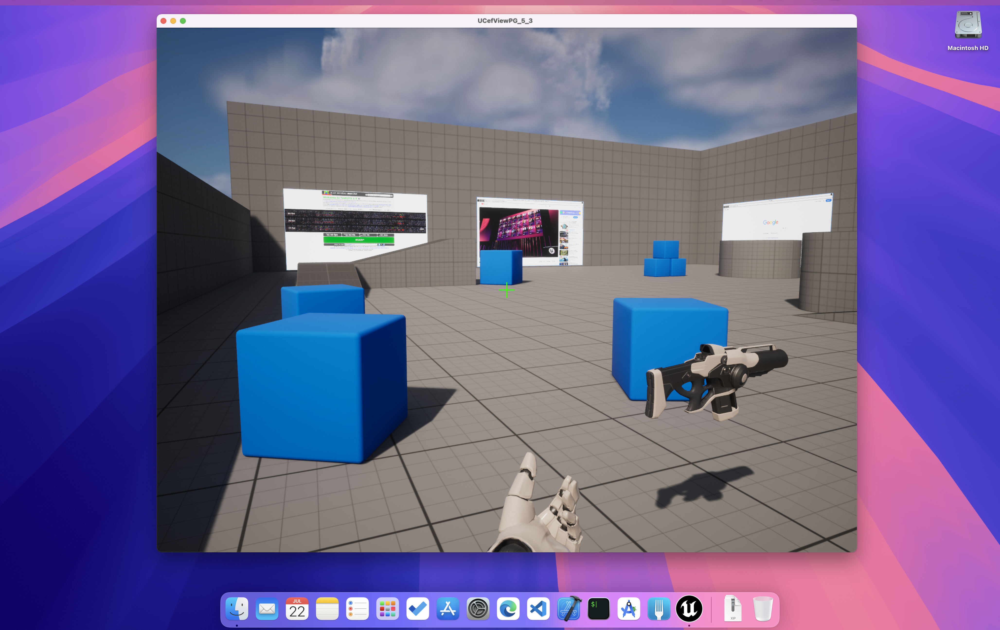
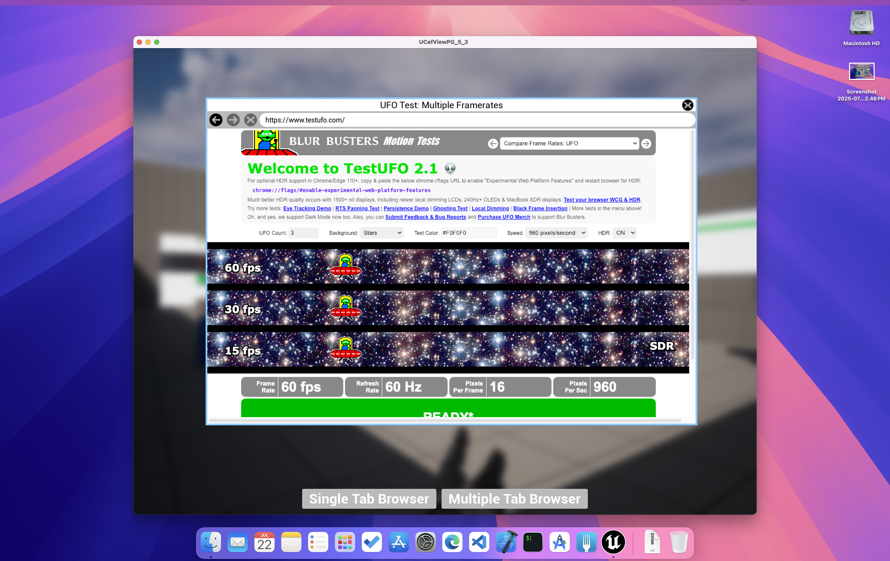

# UCefView

## Fab
[UCefView Marketplace](https://fab.com/s/ec232806c889)

## Demo

- **Source**: [UCefViewPlayGroud](https://github.com/CefView/UCefViewPlayGroud)
- **Packages**:
  - **Win64**: [UCefViewPlayground-UE5.3-Win64](https://drive.google.com/file/d/1SfPZ7mCKH93ngUeyo3rbqbYjf7AHl11a/view?usp=sharing)
  - **macOS**: [UCefViewPlayground-UE5.3-macOS](https://drive.google.com/file/d/1yXzLW_jgtA8IwEBPIFRCKX7Y2sOhVJx_/view?usp=sharing)
  - **Linux**: [UCefViewPlayground-UE5.3-Linux](https://drive.google.com/file/d/1zRFStxa_zhpJXF9o6uXAA57BwUEh9eZ8/view?usp=sharing)

## Documents
[UCefView Documents](https://cefview.github.io/UCefView)

## XCef SDK setup

Install UCefView for your Unreal Engine version and enable it in the project. Open **Project Settings > Engine > UCefView Settings > XCef SDK**, download/install a compatible SDK, choose **Use for this project**, and restart the Editor.

Editor and PIE load the selected shared SDK directly. Editor builds and Live Coding do not copy or clean its runtime files. Game builds stage the configured runtime into the packaged output; players do not need a shared SDK installation or the Editor SDK manager. This workflow applies to both Engine and project plugins.

CEF runs in the separate XCefHost process, so UCefView can coexist with Unreal's built-in Web Browser plugin. Close Editors using a shared SDK before removing or modifying it.

[English SDK guide](docs/ucefview_update_xcef.html) · [中文 SDK 指南](docs/zh/ucefview_update_xcef.html)

## Screenshots

| Platform | In-Game | Menu |
|:---:|:---:|:---:|
| **Windows** |  |  |
| **macOS** |  |  |
